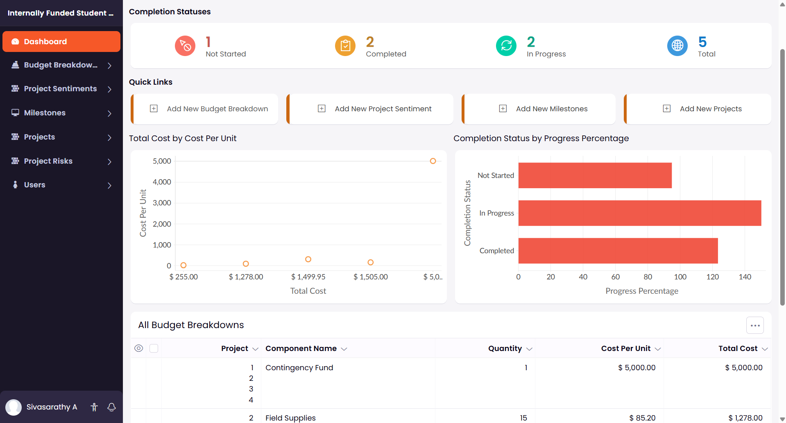
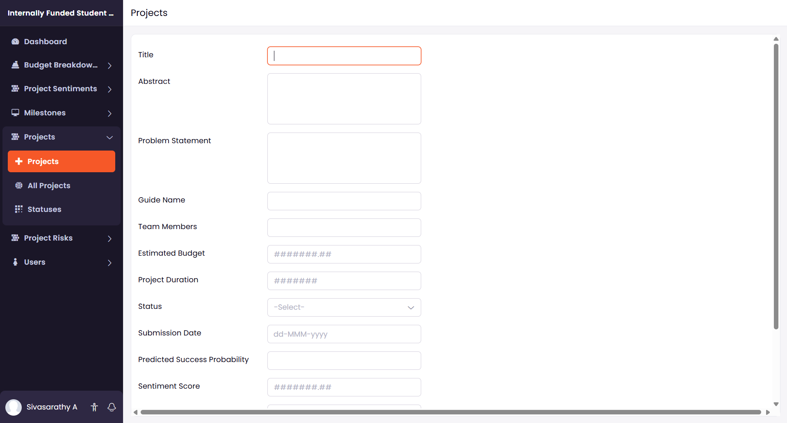
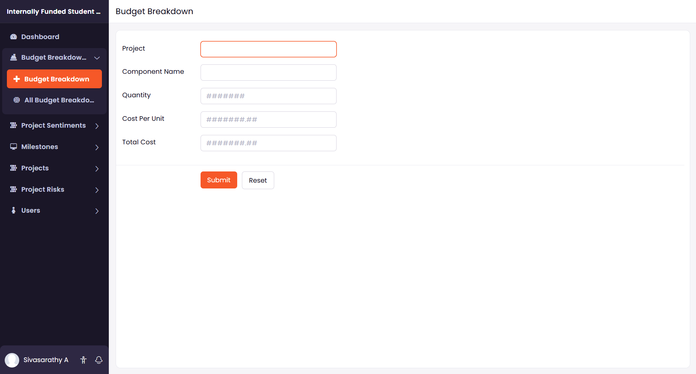
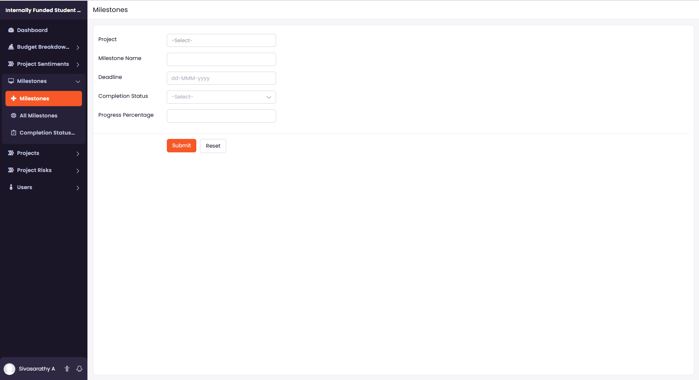
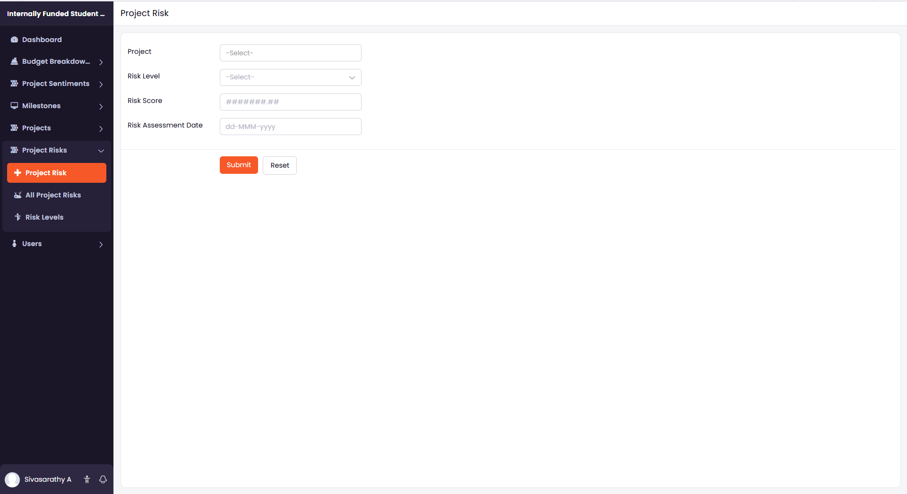
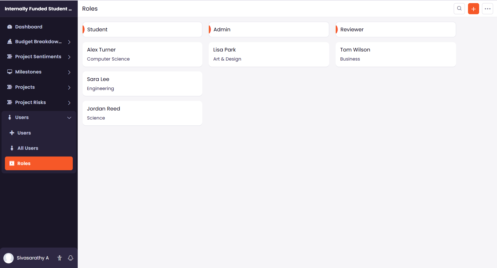
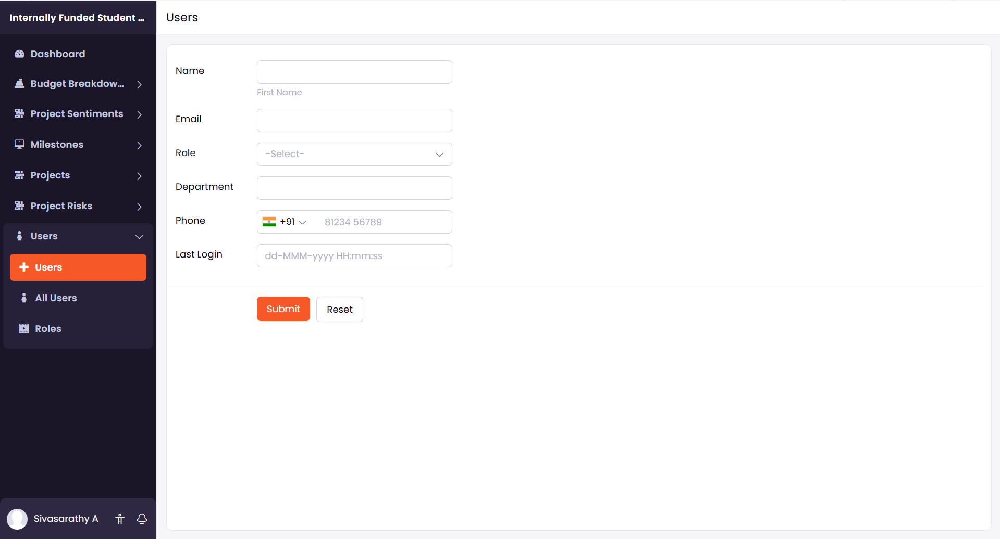
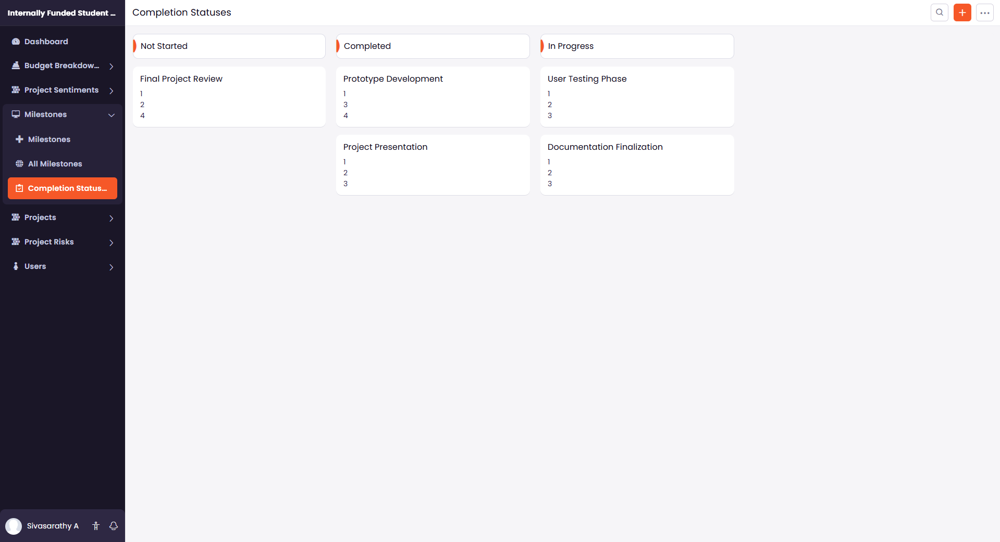
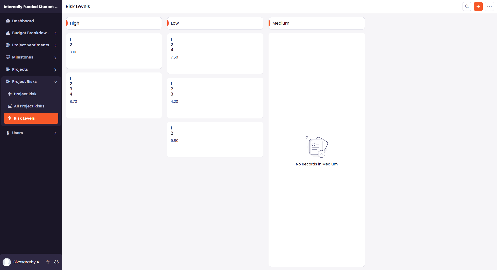
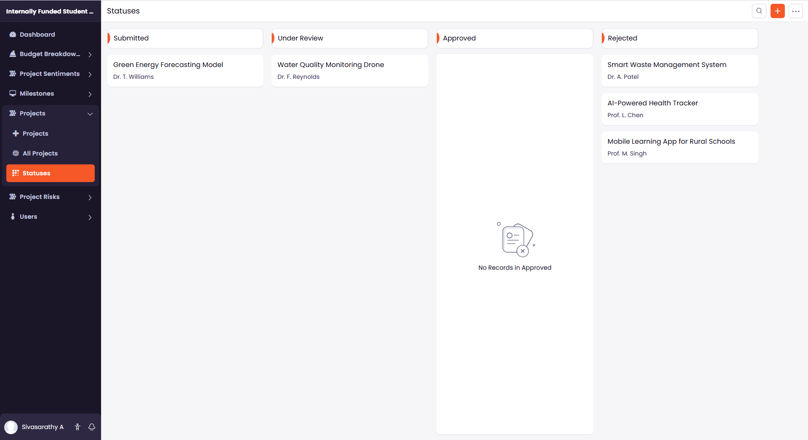

# IFSP Project Management System

## 📌 Overview

The IFSP (Internally Funded Student Project) Management System is a cloud-based application developed using Zoho Creator to digitize and streamline the student project funding process within an academic institution.

This system automates proposal submission, budget tracking, milestone monitoring, project risk analysis, and review workflows through role-based access control and AI-powered insights.

---

## 🎯 Objective

The primary goal of this system is to:

- Eliminate manual paperwork in IFSP management
- Automate proposal review and approval workflow
- Track project budgets and milestones efficiently
- Provide AI-driven risk and performance insights
- Improve transparency and accountability in funding decisions

---

## 🚀 Key Features

### 👨‍🎓 Student Module
- Submit project proposals
- Add team member details
- Upload supporting documents
- Enter budget breakdown
- Track milestone progress

### 🧑‍🏫 Reviewer Module
- Review submitted proposals
- Approve / Reject / Request modifications
- Analyze AI-based risk indicators
- Monitor project completion status

### 👨‍💼 Admin Module
- Manage users and roles
- Track all project submissions
- Monitor funding allocation
- View analytics dashboard
- Control system permissions

---

## 🤖 AI Integration (Zoho Zia)

The application integrates AI capabilities to enhance decision-making:

- Project risk level prediction
- Sentiment-based evaluation of proposals
- Risk categorization
- Performance monitoring insights

---

## 📊 System Modules

- Project Submission Form
- Budget Breakdown Form
- Milestones Tracking
- Risk Assessment Module
- User & Role Management
- Status Monitoring
- Dashboard Analytics

---

## 📸 Application Screenshots

### Dashboard

### Project Submission Form

### Budget Breakdown

### Milestones Tracking

### Risk Assessment

### Role Management

### Users Form

### Completion Status

### Risk Levels

### Status Tracking

---

## 🛠 Technology Stack

- Zoho Creator (Low-Code Development Platform)
- Deluge Scripting
- Zoho Zia AI Integration
- Cloud-based Database
- Role-Based Access Control

---

## 🔐 Security & Access Control

- Role-based authentication (Student, Reviewer, Admin)
- Secure cloud hosting via Zoho Creator
- Controlled data visibility based on user permissions

---

## 🌐 Deployment

The application is deployed on the Zoho Creator Cloud Platform and is accessible via secure login credentials.

Deployment Type: Cloud-Based (SaaS)  
Access Model: Role-Based Authentication  

---

## 📂 Repository Structure

    ifsp-project-management-system/
    │
    ├── screenshots/                 # Application UI screenshots
    │   ├── dashboard.png
    │   ├── project_form.png
    │   ├── budget_breakdown_form.png
    │   ├── milestones_form.png
    │   ├── project_risk_form.png
    │   ├── roles.png
    │   ├── users_form.png
    │   ├── completion_statuses.png
    │   ├── risk_levels.png
    │   └── status.png
    │
    ├── Internally_Funded_Student_Project_Management.ds  # Zoho Creator export file
    ├── README.md
    └── LICENSE
---

## 📈 Impact

This system modernizes the IFSP workflow by:

- Reducing administrative overhead
- Improving proposal transparency
- Enhancing funding decision accuracy
- Providing real-time project monitoring
- Enabling structured project lifecycle management

---

## 📜 License

This project is licensed under the MIT License.

---

## 👨‍💻 Developed By

Sivasarathy  
B.E Computer Science Engineering  
SSN College of Engineering
